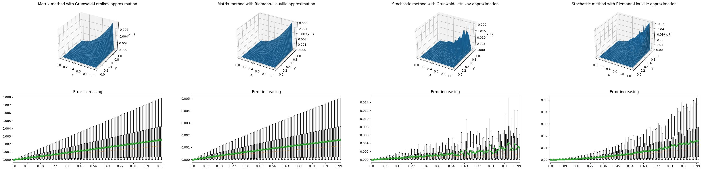

## Задача №1

$$
\frac{d^{\gamma}u(x, t)}{dt^\gamma} = 
\frac{\Gamma(3-\alpha)}{\Gamma(3-\gamma)}x^\alpha + 
\frac{\Gamma(3)}{\Gamma(3-\gamma)}x^2t^{2-\gamma}(1-t^\gamma) \\
$$

$\begin{cases} 
\alpha = 1.7    \\
\gamma = 0.7    \\
X \times T = [1;2] \times [0;1] \\
u(x, 0) = 0     \\
u(1, t) = t^2   \\
u(2, t) = 4t^2  \\
\end{cases}$

### Решение: $u(x, t) = x^2t^2$

